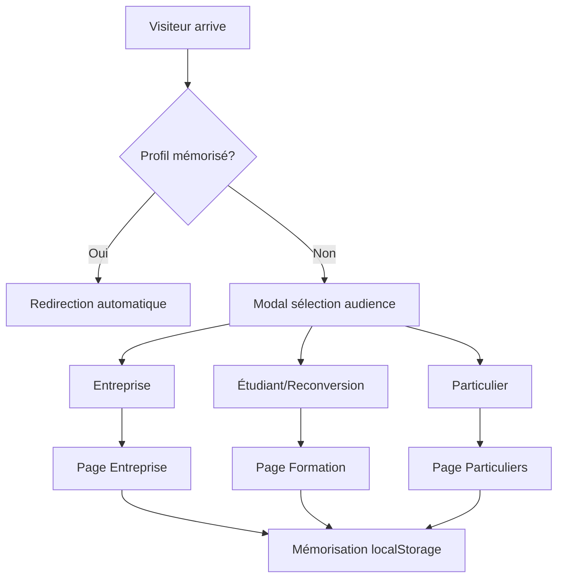

# Design Document - Système de Pages Adaptatives EurinHash

## Overview

Le système de pages adaptatives EurinHash permettra de segmenter automatiquement les visiteurs et de leur proposer du contenu personnalisé. L'architecture repose sur une modal de sélection initiale, un système de routage conditionnel, et trois pages optimisées pour chaque audience.

## Architecture

### Structure des Pages
```
/
├── page.tsx (Router principal avec modal de sélection)
├── entreprise/
│   └── page.tsx (Page actuelle adaptée)
├── formation/
│   └── page.tsx (Page étudiants/reconversion)
├── particuliers/
│   └── page.tsx (Page services individuels)
└── components/
    ├── AudienceSelector.tsx (Modal de sélection)
    ├── ProgramCard.tsx (Cartes programmes formation)
    ├── ServiceCard.tsx (Cartes services particuliers)
    └── ProfileSwitcher.tsx (Changement de profil)
```

### Flux Utilisateur


## Components and Interfaces

### 1. AudienceSelector Component
```typescript
interface AudienceSelectorProps {
  onSelect: (audience: 'entreprise' | 'formation' | 'particuliers') => void;
  isOpen: boolean;
}
```

**Fonctionnalités :**
- Modal overlay avec 3 options visuelles
- Animations d'entrée/sortie
- Fermeture par défaut vers "entreprise"
- Design moderne avec icônes et descriptions

### 2. Page Formation (/formation)
```typescript
interface FormationProgram {
  id: string;
  title: string;
  duration: string;
  level: 'Débutant' | 'Intermédiaire' | 'Avancé';
  price: number;
  description: string;
  skills: string[];
  certification: string;
  career: string[];
}
```

**Sections :**
- Hero orienté carrière et apprentissage
- 5 cartes programmes interactives
- Témoignages d'anciens étudiants
- FAQ spécifique formation
- Formulaire d'inscription détaillé

### 3. Page Particuliers (/particuliers)
```typescript
interface ServiceParticulier {
  id: string;
  title: string;
  description: string;
  price: string;
  duration: string;
  includes: string[];
}
```

**Sections :**
- Hero axé simplicité et accessibilité
- Services à la carte
- Tarifs transparents en FCFA
- Témoignages clients particuliers
- Prise de rendez-vous en ligne

### 4. ProfileSwitcher Component
```typescript
interface ProfileSwitcherProps {
  currentProfile: string;
  onSwitch: () => void;
}
```

## Data Models

### LocalStorage Schema
```typescript
interface UserPreferences {
  audience: 'entreprise' | 'formation' | 'particuliers';
  timestamp: number;
  hasVisited: boolean;
}
```

### Formation Programs Data
```typescript
const FORMATION_PROGRAMS: FormationProgram[] = [
  {
    id: 'programmation',
    title: 'Développement Web & Mobile',
    duration: '6 mois',
    level: 'Débutant',
    price: 450000, // FCFA
    description: 'Maîtrisez les langages modernes et créez des applications complètes',
    skills: ['HTML/CSS/JavaScript', 'React/Node.js', 'Python/Django', 'Mobile (React Native)'],
    certification: 'Certificat EurinHash + Portfolio projets',
    career: ['Développeur Web', 'Développeur Mobile', 'Full-Stack Developer']
  },
  // ... autres programmes
];
```

## Error Handling

### Gestion des Erreurs
1. **Échec localStorage** : Fallback vers cookies ou session
2. **Erreur de routage** : Redirection vers page entreprise
3. **Formulaire invalide** : Validation côté client et serveur
4. **API indisponible** : Messages d'erreur gracieux

### Fallbacks
- Modal ne s'affiche pas → Page entreprise par défaut
- JavaScript désactivé → Liens directs fonctionnels
- Connexion lente → Loading states et skeleton screens

## Testing Strategy

### Tests Unitaires
- Composants AudienceSelector, ProgramCard, ServiceCard
- Logique de routage et mémorisation
- Validation des formulaires

### Tests d'Intégration
- Flux complet de sélection d'audience
- Navigation entre profils
- Persistance des préférences

### Tests E2E
- Parcours utilisateur complet par segment
- Conversion tracking par audience
- Performance sur mobile/desktop

### Tests A/B
- Différentes versions de la modal de sélection
- Variations des CTA par audience
- Optimisation des taux de conversion

## Performance Considerations

### Optimisations
- **Code splitting** par route (entreprise/formation/particuliers)
- **Lazy loading** des composants non critiques
- **Image optimization** pour les témoignages et programmes
- **Prefetching** des pages probables selon le profil

### Métriques à Surveiller
- Temps de chargement initial
- Taux de sélection par audience
- Taux de conversion par segment
- Taux de rebond après sélection

## Security Considerations

### Protection des Données
- Validation stricte des formulaires
- Sanitisation des inputs utilisateur
- Rate limiting sur les soumissions
- HTTPS obligatoire

### Privacy
- Consentement RGPD pour localStorage
- Anonymisation des données analytics
- Droit à l'oubli implémenté

## Implementation Phases

### Phase 1 - Infrastructure (Semaine 1)
- Création de la structure de routage
- Composant AudienceSelector
- Système de mémorisation localStorage

### Phase 2 - Page Formation (Semaine 2)
- Design et développement page formation
- 5 composants ProgramCard
- Formulaire d'inscription

### Phase 3 - Page Particuliers (Semaine 3)
- Design et développement page particuliers
- Composants ServiceCard
- Système de prise de rendez-vous

### Phase 4 - Optimisation (Semaine 4)
- Tests A/B
- Optimisations performance
- Analytics et tracking

Cette architecture modulaire permettra une implémentation progressive et une maintenance facile, tout en offrant une expérience utilisateur optimale pour chaque segment d'audience.