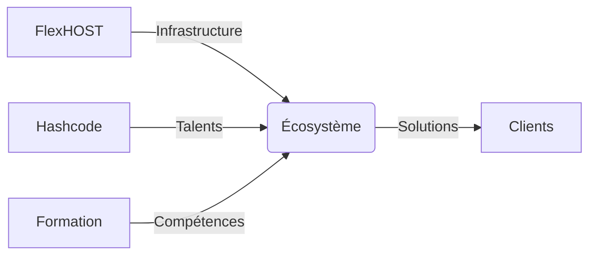

# PLAN STRATÉGIQUE EURINHASH.COM

## Document de travail pourDesigner + Développeur

---

# PHASE 1: MANIFESTE FONDATEUR

## Livrable 1.1: Mise à jour /vision

### Contenu du manifeste à intégrer:

**Titre principal:** Construire l'Infrastructure Numérique Africaine

**Sections:**
1. Préambule - "L'Afrique ne manque pas de développeurs. Elle manque d'architectures."
2. Le problème structurel - Fragmentation, dépendance, faible standardisation
3. La conviction - La souveraineté se conçoit
4. La mission - Concevoir, formaliser, déployer
5. L'engagement - Ne pas improviser, concevoir, structurer, standardiser, transmettre

**Timeline战略** (5 phases):
- Phase 0 (2024-2026): Fondation invisible - Incubation
- Phase 1 (2026-2027): Structuration active
- Phase 2 (2027-2028): Industrialisation  
- Phase 3 (2028-2030): Expansion régionale
- Phase 4 (2030+): Maturité souveraine

---

# PHASE 2: RESTRUCTURATION COMPLÈTE DU SITE

## Navigation proposée (nouveau header):

| Label | Route | Dropdown |
|-------|-------|----------|
| Vision | /vision | Non |
| Architecture | /architecture | Oui - /architecture/overview, /architecture/cloud, /architecture/security, /architecture/data, /architecture/system-design |
| Doctrine | /doctrine | Oui - /doctrine/fondements, /doctrine/cloud, /doctrine/dev, /doctrine/securite, /doctrine/gouvernance |
| Écosystème | /ecosystem | Oui - /ecosystem/overview, /ecosystem/flexhost, /ecosystem/hashcode, /ecosystem/formation, /ecosystem/roadmap |
| Innovation | /innovation | Oui - /innovation/overview, /innovation/ia, /innovation/infrastructure, /innovation/prototypes |
| Académie | /academie | Oui - /academie/programmes, /academie/mentorat, /academie/parcours, /academie/communaute |
| Collaboration | /collaboration | Non |

**CTA permanent:** "Initier une collaboration stratégique" → /collaboration

### Règles UX:
- Maximum 5 sous-liens par dropdown
- Hover desktop + click mobile
- Pas de méga-menu 3 niveaux
- CTA "Collaboration" distinct et mis en évidence

---

# PHASE 3: DÉTAIL DES PAGES

## 3.1 / (Home - Refonte complète)

**Structure narrative obligatoire:**

1. **Hero**
   - Thèse centrale: "Architecte d'infrastructures numériques souveraines"
   - Positionnement: Leader technique cloud en Afrique
   - CTA: "Démarrer votre transformation"

2. **Le problème systémique** 
   - Dépendance cloud étrangère
   - Manque de standards
   - Déficit d'architecture

3. **La réponse architecturale**
   - Approche systémique
   - Solutions sur-mesure

4. **Les 4 piliers**
   - Infrastructure souveraine
   - Formation & mentorat
   - Standards & documentation
   - Communauté

5. **Schéma global écosystème** (diagramme Mermaid)
   - Connexions entre FlexHOST, Hashcode, Formations

6. **Preuves / Réalisations**
   - Projets clients (2-3 témoignages)

7. **Méthodologie**
   - Processus en 3 étapes

8. **Timeline stratégique**
   - Interactive (déjà implémentée)

9. **Appel à collaboration**
   - CTA final

---

## 3.2 /vision (Mise à jour)

**Contenu:**
- Manifeste fondateur complet
- Timeline stratégique interactive
- Vision 10 ans
- Objectifs structurels

---

## 3.3 /architecture (Nouvelle page)

**Sous-sections:**
- /architecture - Méthodologie globale
- /architecture/cloud - Modèle hybrid cloud, VPS + serverless
- /architecture/security - Threat modeling, IAM
- /architecture/data - PostgreSQL, Data governance
- /architecture/system-design - Patterns, Multi-tenant

---

## 3.4 /doctrine (Nouvelle page)

**Contenu:**
- EHAF (Eurin Hash Architecture Framework)
- Standards de code (TypeScript strict)
- Standards cloud
- Standards sécurité
- Standards DevOps

---

## 3.5 /ecosystem (Nouvelle page)

**Projets à présenter:**
- FlexHOST - Hébergement souverain
- Hashcode - Communauté développeurs
- Formation - Programmes éducatifs
- Projets futurs

**Diagramme de connexion:**

---

## 3.6 /innovation (Nouvelle page)

**R&D:**
- Expérimentations IA
- Prototypes
- Infrastructure tests
- Benchmarks

---

## 3.7 /initiatives (Refonte /projects)

**Format obligatoire par projet:**
- Problème initial
- Architecture choisie
- Décisions techniques clés
- Résultat mesurable

**Catégories:**
- Infrastructure & Cloud
- Applications & Plateformes
- Communauté & Formation

---

## 3.8 /academie (Nouvelle page)

**Contenu:**
- Programmes de mentorat
- Pipeline de talents
- Vision éducative
- Événements

---

## 3.9 /collaboration (Mise à jour)

**Formulaire structuré:**
- Type de projet (dropdown)
- Budget estimatif (ranges)
- Niveau d'ambition
- Besoin stratégique (textarea)

---

# PHASE 4: ORDRE DE CONSTRUCTION

## Phase 1 (Priorité haute):
- [ ] Manifeste → /vision
- [ ] Nouvelle Home /
- [ ] Section /architecture

## Phase 2 (Priorité moyenne):
- [ ] /doctrine
- [ ] /ecosystem
- [ ] /initiatives (refonte)

## Phase 3 (Priorité basse):
- [ ] /innovation
- [ ] /academie  
- [ ] /collaboration
- [ ] Optimisation SEO + performance

---

# PHASE 5: CONTraintes TECHNIQUES

## Stack actuelle (à conserver):
- Next.js 15 (App Router)
- TypeScript strict
- Tailwind CSS
- Framer Motion
- Prisma
- Vercel (hébergement)

## Bonnes pratiques:
- Server Components par défaut
- Zod validation
- Clean services layer
- Images via Next/Image

---

# Checklist validation:

- [ ] Manifeste intégré dans /vision
- [ ] Navigation restructurée
- [ ] 7 pages créées/mises à jour
- [ ] Diagramme écosystème
- [ ] SEO optimisé (méta, sitemap, robots.txt)
- [ ] Accessibilité vérifiée (ARIA, contraste)
- [ ] Performance (Lighthouse > 90)
- [ ] Build succès
